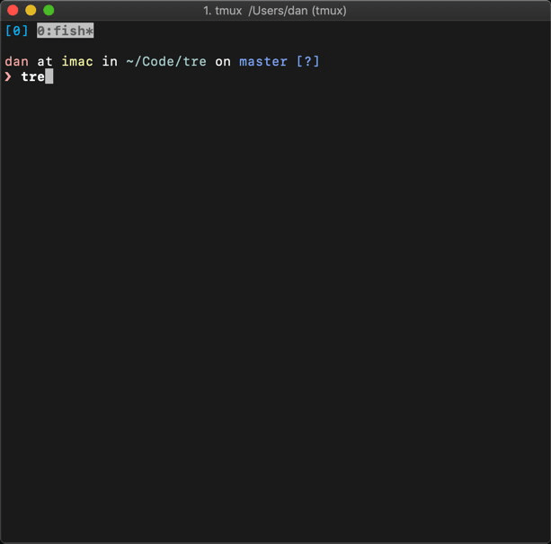

# tre

A replacement for `tree` command that uses `git ls-files` as source of file when
possible.

_tre_ can also create shell aliases that, when executed, opens the file
associated with it with the default editor. Here's that function in action:



… in case you missed it: "22" is listed in front of "README.md" and typing "e22"
opened the file! See [how to set this up](#editor-aliasing).

Runs on Unix as well as Windows PowerShell.

The colors of the output for different file types/diretory, etc, is defined by
the [LS_COLORS][] environment variable (with a set of defaults values).

[LS_COLORS]: https://man7.org/linux/man-pages/man5/dir_colors.5.html

## Install

### Homebrew or Linuxbrew

```
brew install tre-command
```

### Nix

`tre` is available in the official nixpkgs channel as `tre-command`. You can use
it with your favorite Nix-y way.

### Windows (Scoop)

```
scoop install tre-command
```

### Pre-built executable

Choose an pre-built executable from the [release page][] that fits your
platform to download. Unpack it somewhere you'd like to run it from.

[release page]: https://github.com/dduan/tre/releases

### From Source

1. Clone this repository: `git clone https://github.com/dduan/tre.git`.
2. Ensure you have Rust and Cargo installed. If not, follow instruction [here](https://rustup.rs).
3. In the root level of this repo, run `cargo build --release`.
4. Move `target/release/tre` to somewhere in your PATH environment variable.

## Editor aliasing

tre provides a `-e` flag that, when used, turns on the "editor aliasing"
feature. Some shell configuration will make this work better.

### macOS/Linux
By default, the environment variable `$EDITOR` is used as the editor. If a
value following `-e` is supplied (`tre -e emacs` instead of `tre -e`), then
the command specified by this value will be used instead of `$EDITOR`. Update
the script in the next section accordingly.

#### Bash or Zsh

In `~/.bashrc` or `~/.zshrc` (for example)

```bash
tre() { command tre "$@" -e && source "/tmp/tre_aliases_$USER" 2>/dev/null; }
```

#### Fish

Create `~/.config/fish/functions/tre.fish`:

```fish
function tre
  command tre $argv -e; and source /tmp/tre_aliases_$USER ^/dev/null
end
```

### Windows (10+)

Instead of directly executing `tre.exe`, we'll set up a script that's
available in your `PATH` environment variable. For example, you can add
`\Users\yourname\bin` to your `PATH` environment variable, and created the
script there. When you use `tre`, this script executes `tre.exe`, and do some
additional work. The content of the script is different for PowerShell and
Command Prompt.

By default, the default program known by Windows will be used to open the
file. If a value following `-e` is supplied (`tre -e notepad.exe` instead of
`tre -e`), then the command specified by this value will be used. Update the
scripts in the next section accordingly.

#### PowerShell

Add a `tre.ps1` file:

```ps1
if (Get-Module PSReadLine) {
  Remove-Module -Force PSReadLine
}
tre.exe $args -e
. $Env:TEMP\tre_aliases_$env:USERNAME.ps1
```

#### Command Prompt (CMD.exe)

Add a `tre.bat`:

```
@echo off
tre.exe %* -e
call %TEMP%\tre_aliases_%USERNAME%.bat
```

### How it works

The first thing you'll notice is some numbers in front of each file name in
tre's output. If pick a number, say, "3", and enter `e3` in the shell, the file
after "3" will open in your default program (specified by the environment
variable `EDITOR` in macOS/Linux, and picked by Windows).

Everytime tre runs with `-e`, it updates a file in a temporary directory, and
adds an alias for each result it displays. And the additional configuration
simply sources this file after the command. You can manually run

in bash:
```bash
source /tmp/tre_aliases_$USER
```

or

in PowerShell
```ps1
. $Env:TEMP\tre_aliases_$env:USERNAME.ps1
```

or

in Command Prompt

```
call %TEMP%\tre_aliases_%USERNAME%.bat
```

… instead of configuring your system (if you are _that_ patient!).

## License

MIT. See `LICENSE.md`.
