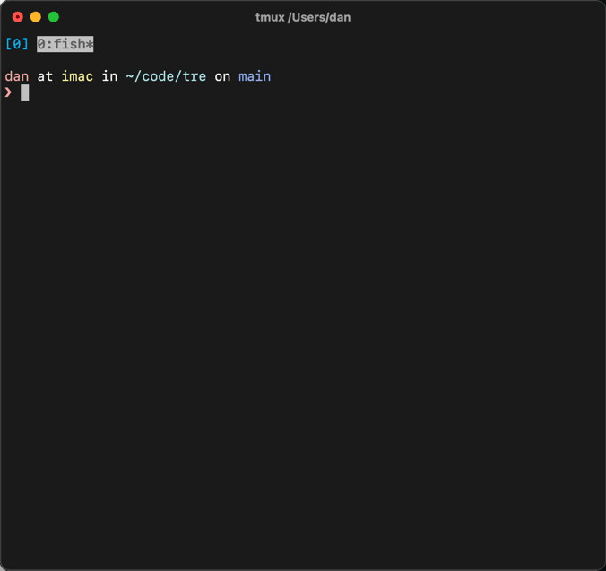

# tre

A modern alternative to the `tree` command that:

* lists directory structure in a tree-like diagram, like the classics.
* skips ignored files in git repositories per `.gitignore` setting.
* creates shell aliases for each listing that opens the files for you.
* output in colors, respecting [LS_COLORS][] settings when they exist.

Command aliasing demo:



… in case you missed it: `[8]` is shown in front of "README.md" and typing `e8`
opened the file! See [how to set this up](#editor-aliasing).

[LS_COLORS]: https://man7.org/linux/man-pages/man5/dir_colors.5.html

## Install

#### Via a package manager

Tre is available in the following package managers.

| Manager / OS            | Command                      |
| ----------------------- | ---------------------------- |
| Homebrew / macOS        | `brew install tre-command`   |
| MacPorts / macOS        | `port install tre-tree`      |
| Debian (testing)        | `apt install tre-command`    |
| Scoop / Windows         | `scoop install tre-command`  |
| Windows Package Manager | `winget install tre-command` |
| Cargo                   | `cargo install tre-command`  |
| AUR / Arch Linux        | `yay -S tre-command`         |
| pkgsrc / NetBSD 9.1+    | `pkgin install tre-command`  |
| Nixpkgs / NixOS         | Use `tre-command`            |
| Nix flake               | Use `github:dduan/tre`       |

_The commands above are basic instructions. Use your favorite alternatives if
you have one. For example, use a config file for Nix; or other method to install
from AUR; pkgsrc can be use on OSes other than NetBSD etc._

### Pre-built executable

Choose an pre-built executable from the [release page][] that fits your
platform to download. Unpack it somewhere you'd like to run it from.

[release page]: https://github.com/dduan/tre/releases

### From Source

1. Clone this repository: `git clone https://github.com/dduan/tre.git`.
2. Ensure you have Rust and Cargo installed. If not, follow instruction [here](https://rustup.rs).
3. In the root level of this repo, run `cargo build --release`.
4. Move `target/release/tre` to somewhere in your PATH environment variable.

## Editor aliasing

tre provides a `-e` flag that, when used, turns on the "editor aliasing"
feature. Some shell configuration will make this work better.

### macOS/Linux
By default, the environment variable `$EDITOR` is used as the editor. If a
value following `-e` is supplied (`tre -e emacs` instead of `tre -e`), then
the command specified by this value will be used instead of `$EDITOR`. Update
the script in the next section accordingly.

#### Bash or Zsh

In `~/.bashrc` or `~/.zshrc` (for example)

```bash
tre() { command tre "$@" -e && source "/tmp/tre_aliases_$USER" 2>/dev/null; }
```

#### Fish

Create `~/.config/fish/functions/tre.fish`:

```fish
function tre
  command tre $argv -e; and source /tmp/tre_aliases_$USER ^/dev/null
end
```

### Windows (10+)

Instead of directly executing `tre.exe`, we'll set up a script that's
available in your `PATH` environment variable. For example, you can add
`\Users\yourname\bin` to your `PATH` environment variable, and created the
script there. When you use `tre`, this script executes `tre.exe`, and do some
additional work. The content of the script is different for PowerShell and
Command Prompt.

By default, the default program known by Windows will be used to open the
file. If a value following `-e` is supplied (`tre -e notepad.exe` instead of
`tre -e`), then the command specified by this value will be used. Update the
scripts in the next section accordingly.

#### PowerShell

Add a `tre.ps1` file:

```ps1
if (Get-Module PSReadLine) {
  Remove-Module -Force PSReadLine
}
tre.exe $args -e
. $Env:TEMP\tre_aliases_$env:USERNAME.ps1
```

#### Command Prompt (CMD.exe)

Add a `tre.bat`:

```
@echo off
tre.exe %* -e
call %TEMP%\tre_aliases_%USERNAME%.bat
```

### How it works

The first thing you'll notice is some numbers in front of each file name in
tre's output. If pick a number, say, "3", and enter `e3` in the shell, the file
after "3" will open in your default program (specified by the environment
variable `EDITOR` in macOS/Linux, and picked by Windows).

Everytime tre runs with `-e`, it updates a file in a temporary directory, and
adds an alias for each result it displays. And the additional configuration
simply sources this file after the command. You can manually run

in Bash/Zsh/Fish:
```bash
source /tmp/tre_aliases_$USER
```

or

in PowerShell
```ps1
. $Env:TEMP\tre_aliases_$env:USERNAME.ps1
```

or

in Command Prompt

```
call %TEMP%\tre_aliases_%USERNAME%.bat
```

… instead of configuring your system (if you are _that_ patient!).

## Everything else

Here's the output from `tre -h`, showing all available options provided by tre:

```
USAGE:
    tre [OPTIONS] [PATH]

ARGS:
    <PATH>    [default: .]

OPTIONS:
    -a, --all                   Print all files and directories, including hidden ones
    -c, --color <WHEN>          When to color the output. `automatic` means when printing to a
                                terminal, tre will include colors; otherwise it will disable colors
                                [default: automatic] [possible values: automatic, always, never]
    -d, --directories           Only list directories in output
    -e, --editor [<COMMAND>]    Create aliases for each displayed result, and add a number in front
                                of file name to indicate the alias name. For example, a number "42"
                                means an shell alias "e42" has been created. Running "e42" will
                                cause the associated file or directory to be open with $EDITOR (or a
                                default program for the file type on Windows), or a command
                                specified along with this command
    -E, --exclude <PATTERN>     Exclude paths matching a regex pattern. Repeatable
    -h, --help                  Print help information
    -j, --json                  Output JSON instead of tree diagram
    -l, --limit <LIMIT>         Limit depth of the tree in output
    -p, --portable              Generate portable (absolute) paths for editor aliases. By default,
                                aliases use relative paths for better performance
    -s, --simple                Use normal print despite gitignore settings. '-a' has higher
                                priority
    -V, --version               Print version information
```

If you like the editor aliasing feature, you may want to check out [ea][].

[ea]: https://github.com/dduan/ea

## Packaging

`tre` is a standard Cargo-managed Rust project.
A unix manual is available at `manual/tre.1`.
Completion scripts for various shells are at `scripts/completion`.

## License

MIT. See `LICENSE.md`.
